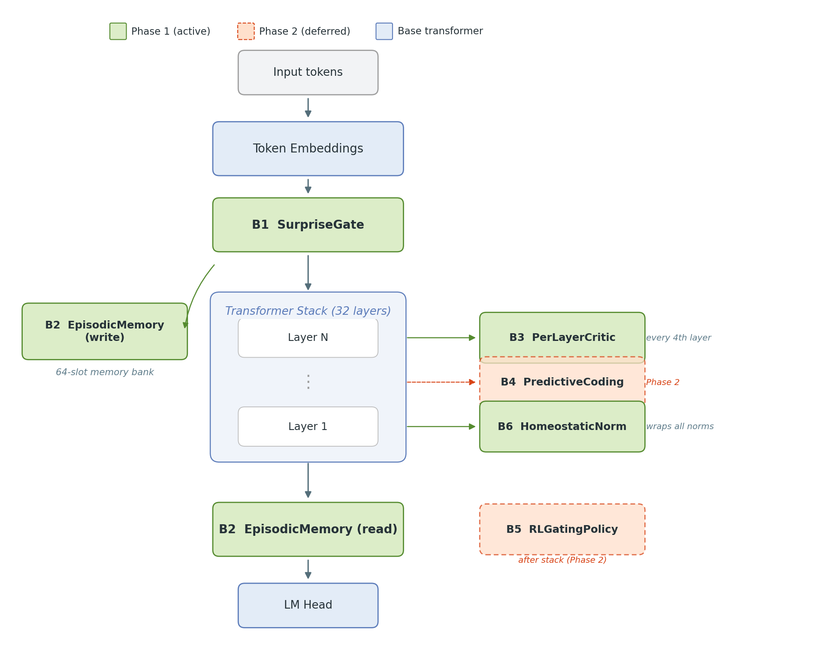
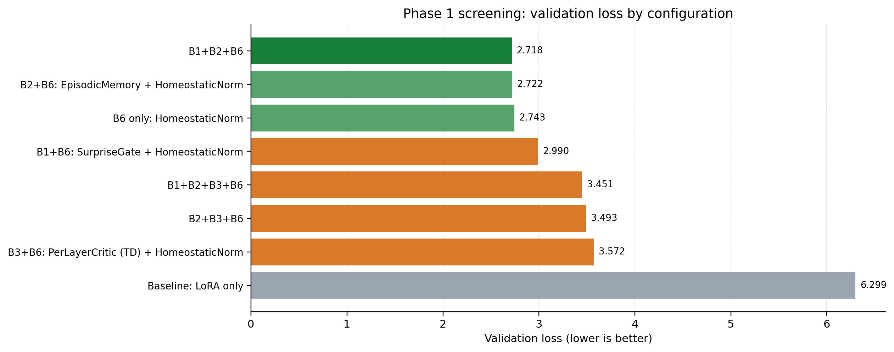

# Cognitive LLM

Neuroscience-inspired architectural blocks for small language models. We augment a frozen [SmolLM-360M](https://huggingface.co/HuggingFaceTB/SmolLM-360M) backbone with six cognitive block families and run controlled ablation experiments to measure their individual and combined effects on reasoning performance.

**Paper:** [Memory Dominates Routing: A Controlled Screening of Neuroscience-Inspired Transformer Blocks](paper/main.pdf)

## Architecture

<p align="center">
  
</p>

Six plug-in blocks wrap or augment a frozen transformer backbone. Each block is independently toggleable for clean ablation:

| Block | Name | Inspiration | Role |
|:-----:|------|-------------|------|
| B1 | **SurpriseGate** | Predictive processing (Friston) | Gates hidden states by prediction-error magnitude |
| B2 | **EpisodicMemory** | Hippocampal rapid learning (Kumaran et al.) | Online key-value memory bank for episodic retrieval |
| B3 | **PerLayerCritic** | Prefrontal value signals (Wang) | Intermediate critic for TD-style training signal |
| B4 | **PredictiveCoding** | Visual cortex (Rao & Ballard) | Top-down error correction between layers |
| B5 | **RLGatingPolicy** | Meta-RL (Hassabis et al.) | Learned policy for block activation routing |
| B6 | **HomeostaticNorm** | Homeostatic plasticity | EMA-based activation stabilization |

## Results

Phase 1 screening on GSM8K (SmolLM-360M + LoRA, 8 configurations):

<p align="center">
  
</p>

| Rank | Configuration | Val Loss | vs Baseline |
|:----:|---------------|:--------:|:-----------:|
| 1 | B1 + B2 + B6 | 2.718 | **-56.8%** |
| 2 | B2 + B6 | 2.722 | **-56.8%** |
| 3 | B6 only | 2.743 | **-56.5%** |
| — | Baseline (LoRA only) | 6.299 | — |

**Key finding:** HomeostaticNorm (B6) alone accounts for most of the improvement. EpisodicMemory (B2) adds a small marginal gain. The PerLayerCritic (B3) consistently *hurts* performance, suggesting that intermediate critic signals interfere with the base model's learned representations.

## Repository Structure

```
cognitive_llm/
├── blocks/             Six cognitive block implementations (nn.Module)
├── models/             CognitiveModel wrapper with toggleable block composition
├── training/           Training loop, RL trainer, reward shaping, device abstraction
└── evaluation/         Benchmark runners, ablation framework
configs/                Experiment configuration (YAML)
tests/                  Unit tests for every block and the model wrapper
notebooks/              Phase 1 ablation notebook
paper/                  LaTeX manuscript, figures, and frozen results
train.py                Single-experiment entry point
```

## Quick Start

```bash
pip install -r requirements.txt
python train.py
```

Run the test suite:

```bash
pytest tests/ -v
```

Reproduce the paper figures:

```bash
python paper/scripts/make_figures.py
```

## Design Principles

- **Frozen backbone** — all blocks are additions on top of a LoRA-adapted base; original weights are never modified
- **Toggleable blocks** — each block is controlled by a config flag (`use_block1`, ..., `use_block6`) for clean ablation
- **Stability first** — HomeostaticNorm (B6) is always enabled alongside other blocks to prevent training divergence
- **Architecture-agnostic** — CognitiveModel auto-detects layer structure and works across SmolLM, OLMo, and LLaMA families

## License

[Apache 2.0](LICENSE)
